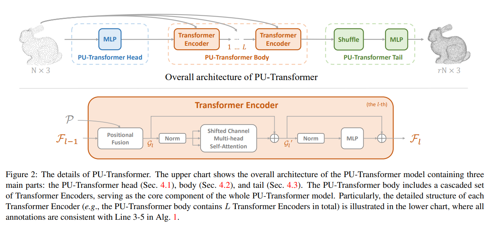
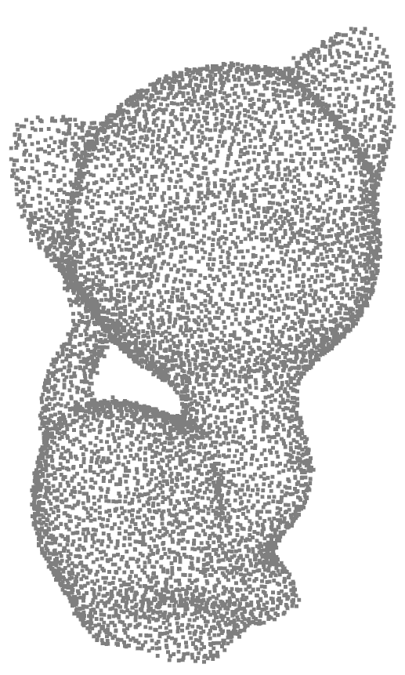

# PU-Transformer-pytorch
Pytorch unofficial implementation of PU-Transformer

(PU-Transformer: Point Cloud Upsampling Transformer)

https://arxiv.org/abs/2111.12242

# Model Structure
**Model**

# Evaluation
**Input : 2048**  
**Output : 8192**  
**Test Dataset : PU-GAN dataset**    

| X4 | Chamfer Distance(10-3)|HD(10-3)|
|:--------|:--------:|:--------:|
| This code | **0.2718**|**3.161**|
|Paper|**0.273**|**2.605**| 

# Visualize
**Ground Truth**  

**Model Prediction**  

